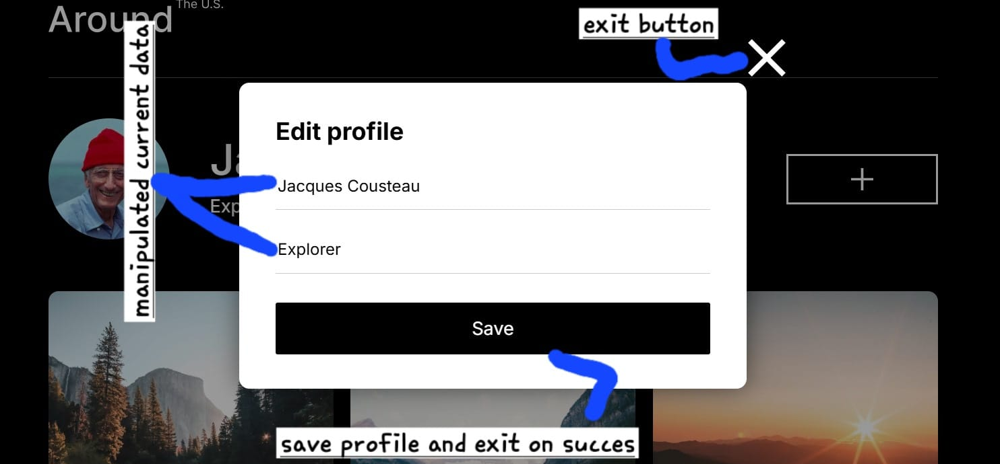

# Around the U.S.

## A gallery Website – A Modern Visual Showcase

Welcome to my Gallery Website, a visually stunning platform designed with advanced HTML, CSS, and Javascript. This project showcases a sleek and responsive design, ensuring a seamless browsing experience across all devices.

The gallery features a modern layout, and an intuitive user interface, making it perfect for displaying images in an elegant and immersive way. Toggling modal form and dynamically update profile content by inserting appropriate required data.

Stay tuned for more updates as I continue improving and transforming this gallery into a fully interactive experience! 🚀

### Technologies:

- HTML
- CSS
- JavaScript

[Around the U.S Github Repository](https://github.com/habibAbdelgaber/se_project_aroundtheus)

[Github Pages](https://github.com/habibAbdelgaber/se_project_aroundtheus/settings/pages)

[View the gallery](https://gallery.pymastery.com/)

[Around the U.S](https://vimeo.com/1052391061/27c08d2eae)

